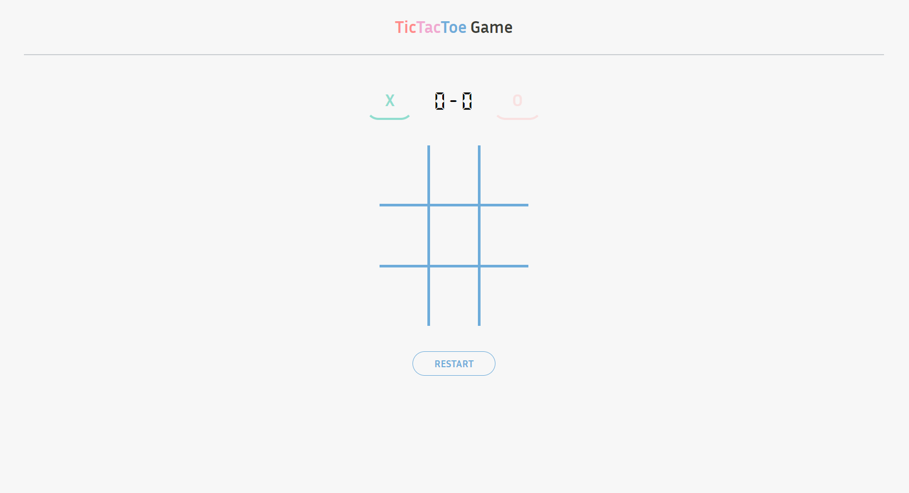

# Tic Tac Toe

> Tic Tac Toe Game



Tic Tac Toe is a two-player game on a 3x3 grid where players take turns marking "X" or "O." The goal is to align three symbols in a row, column, or diagonally. If no one wins and the grid is full, the game ends in a draw.

## Features

- Created to play between 2 players locally
- Responsive design works with desktop and mobile
- Restart button of board game
- Scoreboard in session play
   
## Built with

- React
- Redux

## Live Demo

[Live Demo Link](https://tictactoe-sv.vercel.app/)

## Getting Started

To create a copy and run it locally

### Requisites

- NodeJS
- Yarn

### Setup

```bash
git clone https://github.com/sebastianvarelag/tictactoe
cd ./tictactoe
```

### Install

```bash
yarn
```

### Usage

```bash
yarn start
```

### Build

```bash
yarn build
```

### Run tests

```bash
yarn test
```

## Author

👨🏻‍💻 **Sebastián Varela Giraldo**

- Linkedin: [Linkedin](https://www.linkedin.com/in/sebastianvarelag/)
- GitHub: [@sebastianvarelag](https://github.com/sebastianvarelag)
